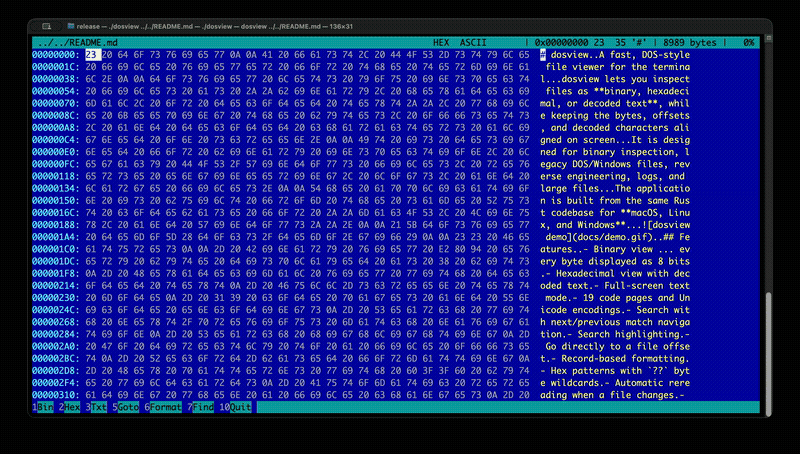

# dosview

A fast, DOS-style file viewer for the terminal.

dosview lets you inspect files as **binary, hexadecimal, or decoded text**, while keeping the bytes, offsets, and decoded characters aligned on screen.

It is designed for binary inspection, legacy DOS/Windows files, reverse engineering, logs, and large files.

The application is built from the same Rust codebase for **macOS, Linux, and Windows**.



## Features

- Binary view — every byte displayed as 8 bits
- Hexadecimal view with decoded text
- Full-screen text mode
- 19 code pages and Unicode encodings
- Search with next/previous match navigation
- Search highlighting
- Go directly to a file offset
- Record-based formatting
- Hex patterns with `??` byte wildcards
- Automatic rereading when a file changes
- Horizontal scrolling and wrapping of long records
- 64-bit file offsets
- Efficient handling of very large files
- Low memory usage
- Native terminal UI with no GUI dependencies

## Installation

Download the latest release for your operating system from:

**[GitHub Releases](https://github.com/FonDorn/dos_view/releases)**

### macOS

Choose the version that matches your Mac:

| Mac | File |
|---|---|
| Apple Silicon (M1/M2/M3/M4) | `dosview-*-macos-arm64` |
| Intel | `dosview-*-macos-x86_64` |

After downloading:

```bash
chmod +x dosview-*-macos-*
./dosview-*-macos-* path/to/file
```

For example:

```bash
./dosview-0.1.0-macos-arm64 image.bin
```

You can also rename the executable to simply `dosview`.

macOS may show a security warning because the downloaded binary is not signed or notarized. If necessary, remove the quarantine attribute:

```bash
xattr -d com.apple.quarantine ./dosview
```

### Linux

Choose the version that matches your system:

| System | File |
|---|---|
| x86_64 | `dosview-*-linux-x86_64` |
| ARM64 | `dosview-*-linux-arm64` |

Then:

```bash
chmod +x dosview-*
./dosview-* path/to/file
```

For example:

```bash
./dosview-0.1.0-linux-x86_64 image.bin
```

### Windows

Download:

```text
dosview-*-windows-x86_64.exe
```

Run it from PowerShell:

```powershell
.\dosview-0.1.0-windows-x86_64.exe path\to\file
```

Or from Command Prompt:

```cmd
dosview-0.1.0-windows-x86_64.exe path\to\file
```

## Build from source

### Requirements

- Rust 1.87 or newer
- Cargo

Check your installation:

```bash
rustc --version
cargo --version
```

Clone the repository:

```bash
git clone https://github.com/FonDorn/dos_view.git
cd dos_view
```

Build a release version:

```bash
cargo build --release
```

The binary will be created at:

```text
target/release/dosview
```

Run it:

```bash
./target/release/dosview path/to/file
```

On Windows:

```powershell
.\target\release\dosview.exe path\to\file
```

## Usage

Basic usage:

```bash
dosview <file>
```

Examples:

```bash
dosview image.bin
dosview firmware.bin
dosview program.exe
dosview logfile.dat
```

dosview does not load the entire file into memory. It reads only the data required around the current position, which makes it practical for very large files.

A 50 GB file can be opened without allocating 50 GB of RAM.

## Views

### Binary mode

Press `1`.

Every byte is displayed as eight bits:

```text
00000000: 01001000 01000101 01001100 01001100 01001111
```

### Hex mode

Press `2`.

The file is displayed as hexadecimal bytes with a decoded text column:

```text
00000000: 48 65 6C 6C 6F 2C 20 77 6F 72 6C 64 21   Hello, world!
```

### Text mode

Press `3`.

The file is displayed as decoded text using the selected code page.

## Code pages

dosview supports 19 code pages and encodings:

| Code page | Description |
|---|---|
| `ASCII` | Classic ASCII |
| `CP437` | Original IBM PC / DOS |
| `CP850` | DOS Western Europe |
| `CP852` | DOS Central Europe |
| `CP866` | DOS Cyrillic |
| `CP1250` | Windows Central Europe |
| `CP1251` | Windows Cyrillic |
| `CP1252` | Windows Western Europe |
| `ISO-8859-1` | Latin-1 |
| `ISO-8859-2` | Latin-2 |
| `ISO-8859-5` | ISO Cyrillic |
| `ISO-8859-15` | Latin-9 |
| `KOI8-R` | Russian Cyrillic |
| `KOI8-U` | Ukrainian Cyrillic |
| `MacRoman` | Classic Mac OS Western |
| `MacCyrillic` | Classic Mac OS Cyrillic |
| `UTF-8` | UTF-8 |
| `UTF-16LE` | UTF-16 little-endian |
| `UTF-16BE` | UTF-16 big-endian |

Press `F3` or `#` to open the complete code-page list.

Use `e` / `E` to switch to the next or previous code page.

## Search

Press `7` or `F7` to search.

Text searches use the currently selected code page.

For example, when viewing a CP866 file, searching for:

```text
Привет
```

searches for the corresponding CP866 bytes.

### Hex search

Use the `x:` prefix:

```text
x:89 50 4E 47
```

Wildcards are supported:

```text
x:89 ?? 4E 47
```

`??` matches any byte.

Matches are highlighted in both the byte and text columns.

| Key | Action |
|---|---|
| `7` / `F7` | Start search |
| `n` / `F8` | Next match |
| `p` / `N` | Previous match |
| `9` (while searching) | Next match |
| `8` (while searching) | Previous match |
| `Esc` | Clear search |
| `h` | Toggle highlighting |

## File offsets

Press `5` or `F5` to jump to a specific offset.

Offsets are hexadecimal by default:

```text
2A0
```

means:

```text
0x2A0
```

You can also use:

```text
0x2A0
$2A0
2A0h
```

To enter a decimal offset, prefix it with `d`:

```text
d672
```

## Formatting records

Press `6` or `F6` to split the file into records based on a pattern.

For example:

```text
x:0A
```

treats each line-feed byte as a record separator.

This is useful for viewing line-oriented files and structured binary data.

Hex patterns can also contain wildcards:

```text
x:89 ?? 4E 47
```

Long records can either be:

- cut to the visible width;
- wrapped across multiple lines.

Press `9` or `F9` to switch between these modes.

## Keyboard shortcuts

| Key | Action |
|---|---|
| `1` | Binary mode |
| `2` | Hex + text mode |
| `3` | Text mode / next code page |
| `F3` / `#` | Select code page |
| `e` / `E` | Next / previous code page |
| `[` / `]` | Decrease / increase bytes per line |
| `\` | Fit columns to the window |
| `←` `→` `↑` `↓` | Move cursor |
| `Home` / `End` | Start / end of file |
| `Ctrl+A` / `Ctrl+E` | Start / end of line |
| `^` / `$` | Start / end of line |
| `PgUp` / `PgDn` | Page up / down |
| `Shift+←` / `Shift+→` | Shift byte alignment |
| `5` / `F5` | Go to offset |
| `6` / `F6` | Format records |
| `7` / `F7` | Search |
| `n` / `F8` | Next match |
| `p` / `N` | Previous match |
| `9` / `8` (while searching) | Next / previous match |
| `Esc` | Clear search |
| `9` / `F9` (with records formatted) | Wrap long records |
| `h` | Toggle highlighting |
| `r` | Reread file |
| `q` / `F10` | Quit |

Additional aliases:

```text
g  -> goto
/  -> search
n  -> next match
```

## Large files

dosview is designed to work with files much larger than available RAM.

The reader maintains a moving 1 MiB buffer instead of loading the entire file. Search is performed in overlapping blocks so matches crossing a block boundary are not missed.

File offsets use 64-bit integers, allowing files larger than 4 GiB to be addressed.

The display is also virtualized: only the bytes required for the current screen are rendered.

## Following changing files

dosview automatically checks whether the opened file has changed.

This makes it useful for watching files that are being written by another process, such as logs.

Press:

```text
r
```

to force an immediate reread.

The application also handles programs that replace a file by writing a new file and renaming it over the original.

## macOS keyboard support

macOS terminals reserve some key combinations for system functions. For example, `Ctrl+←` and `Ctrl+→` can be used for switching Spaces before an application receives them.

For that reason, dosview also provides:

```text
Ctrl+A / Ctrl+E
^ / $
```

for moving to the beginning and end of a line.

## Development

Run a debug build:

```bash
cargo build
```

Run directly:

```bash
cargo run -- path/to/file
```

Run tests:

```bash
cargo test
```

Check formatting:

```bash
cargo fmt --check
```

Run Clippy:

```bash
cargo clippy --all-targets --all-features -- -D warnings
```

## Project structure

```text
src/
├── main.rs
├── reader.rs
├── pattern.rs
├── encoding.rs
└── view.rs
```

### `reader.rs`

File reading, navigation, buffering, and searching.

### `pattern.rs`

Text and hexadecimal patterns, including byte wildcards.

### `encoding.rs`

Code-page tables and text encoding/decoding.

### `view.rs`

Data formatting and terminal layout.

### `main.rs`

Application state, event handling, rendering, and terminal lifecycle.

## Release binaries

Precompiled binaries are published on the GitHub Releases page:

https://github.com/FonDorn/dos_view/releases

Each release provides binaries for:

- macOS ARM64
- macOS x86_64
- Linux ARM64
- Linux x86_64
- Windows x86_64

SHA-256 checksums are provided with each release.

## License

dosview is released under the [MIT License](LICENSE).

## Author

**Mike Nedosekin**

GitHub: https://github.com/FonDorn

Repository: https://github.com/FonDorn/dos_view